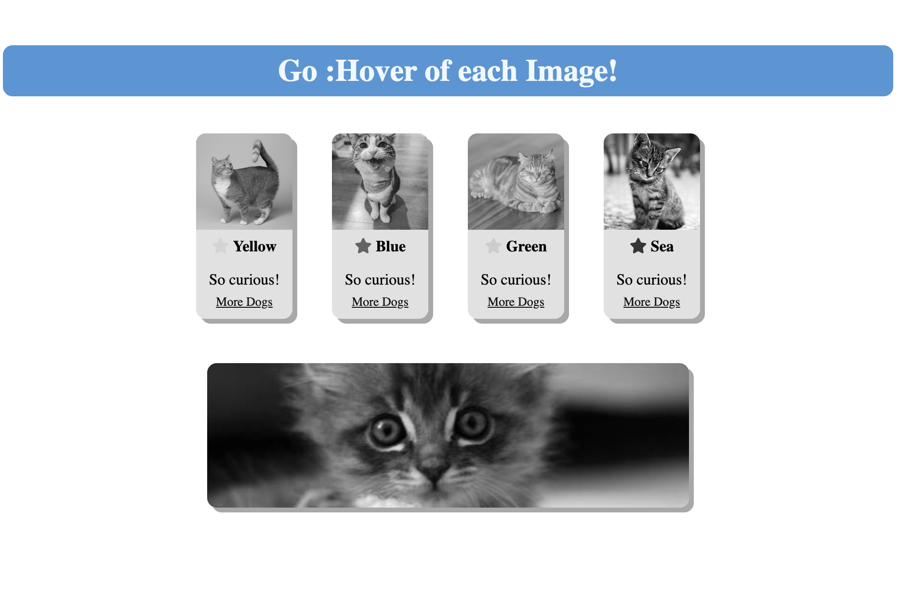

# UNLV-Job_HTML 3Layout-Recap  

### Description:  
In this Job we have to demonstrate your abilities creating a span with multiple elements like header,
images, paragraph, #id, class, and other more. 

## I use the resources to get "feedback":
• W3schools :   https://www.w3schools.com/
| • Unsplash :    https://unsplash.com/s/photos/cat
| • Fontawesome : https://fontawesome.com/search

## Contact Information :
 • Github :      https://github.com/danielFernandezDj?tab=repositories
| • Linkedin :    https://www.linkedin.com/in/daniel-fernandez-953432122/

